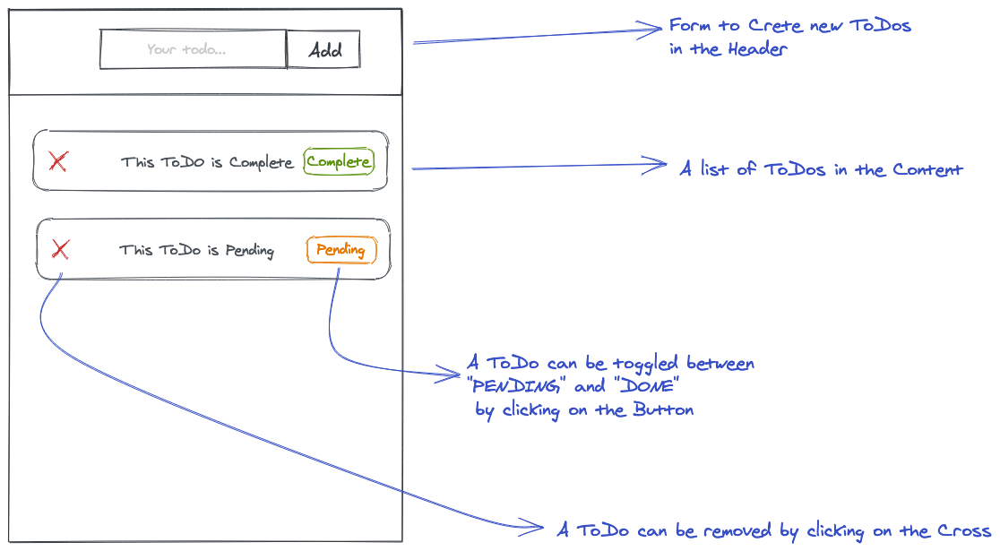

# Exercise: ToDo App

Your goal is to build a ToDo app in React that looks a bit like this mockup here:



A todo can have 2 possible status:

- "PENDING": The ToDo is still there to be done.
- "DONE": The ToDo is already completed

## What can the user do?

As a user of the ToDo app, I want to:

- Create new ToDos. Per default a ToDo should be "PENDING"
- Remove existing ToDos
- Toggle ToDos, from "PENDING" to "COMPLETED" and Viceversa

## How to approach it?

Read this article [Thinking in React](https://reactwithhooks.netlify.app/docs/thinking-in-react.html).
The article explains how to approach such a project

## How can I structure my data?

Think about which data you need to render a ToDo:

- The ToDo text
- The Status

Think about which data type you can use to represent them:

- The ToDo Text is a string, because it's how we represent text in JavaScript
- The ToDo Status can be represented in different ways, but we can also use a string and
  constrain it to 2 values: "PENDING" and "COMPLETED"

If a ToDo has 2 different properties, then we group this data in an object. That's the way JavaScript allows us to group data that belongs together

We are representing many ToDos, hence we need a list of data. As you know, n JavaScript we use arrays to represent lists of data.

Hence, a possbile structure for your data could be:

```js
[
  {
    text: "Throw the trash",
    status: "PENDING",
  },
  {
    text: "Take the dog out",
    status: "COMPLETED",
  },
];
```

## Resources

Chapters 1 to 12 here helps a lot to understand React

- [Main Concepts of React](https://reactwithhooks.netlify.app/docs/getting-started.html)
  - In chapter 6, they talk about `useEffect`. This is something we didn't learn yet and that's
    not needed for this task. You can skip it.
    
Other links:

- [Best practices to keep objects and arrays immutable in javascript.](https://dev.to/antonio_pangall/best-practices-to-keep-objects-and-arrays-immutable-in-javascript-3nmm)
- [Spread operator](https://developer.mozilla.org/en-US/docs/Web/JavaScript/Reference/Operators/Spread_syntax)
- [Recap map() method()](https://neuefische-students.slack.com/archives/G01Q1DL5F41/p1617272650004900) 
- [Recap of filter() method()](https://neuefische-students.slack.com/archives/G01Q1DL5F41/p1617282521007500)

## Additional Challanges
If you done with the initial exercises and you want to push yourself, here are some ideas how you can add some features to your app

- Make the todos render in different lists, depending on the `status` of the todo. If the todo is `PENDING` render the todo in the `Pending List`. If the todo is `DONE`, render it in the `Done List`
- Create a new state for your app for a feature you like (for example create a `Pending | Done` Filter where you display only the `pending` todos or only the  `done` todos. (you may not need the seperate Lists from the challange before anymore. It depends how you want to display things)


- Create in the todo a button which let you change the name of the todo and save it.

Have fun!
